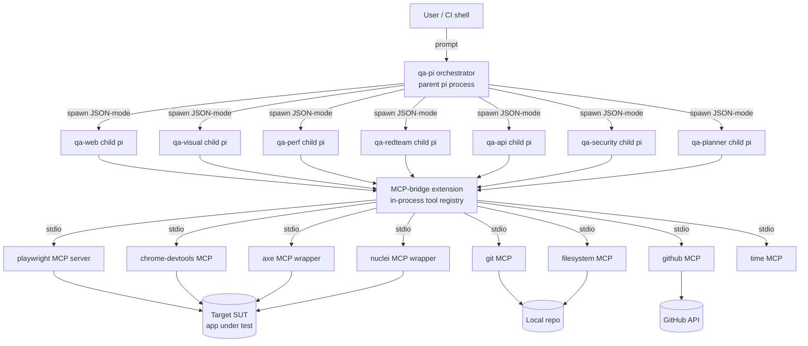
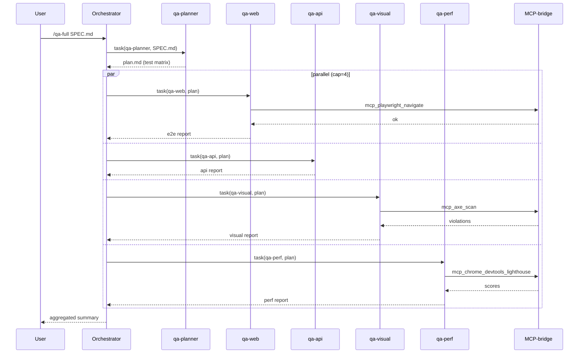
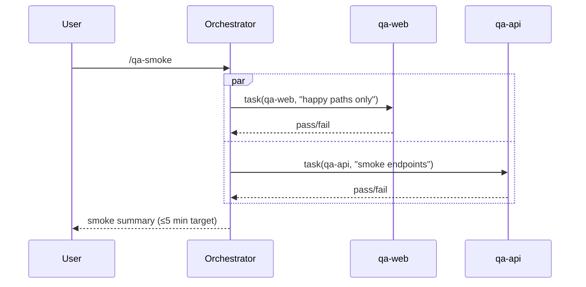
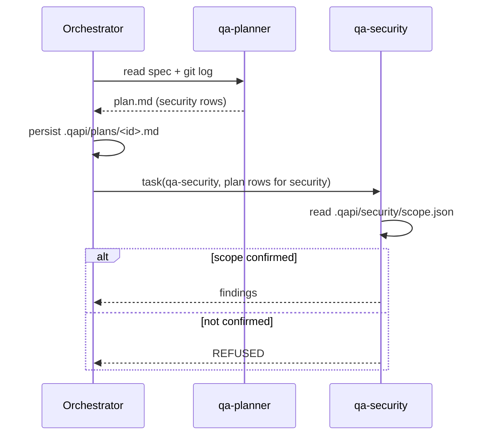

## System Diagram



## Process Model

`qa-pi` reuses pi's process model and adds a thin orchestration layer.

- **Orchestrator** — the user-facing pi process. Holds the chat session, the agent registry (`~/.qapi/agents/` and `<repo>/.qapi/agents/`), and the MCP-bridge extension instance.
- **Subagent invocation** — when the orchestrator decides to call a subagent (via the `task` tool), it spawns a fresh `pi` child process with:
  - `--agent <name>` (system prompt and tools allowlist loaded from the agent's frontmatter)
  - `--json` (stdin/stdout JSON-RPC frames; one tool call / result per frame)
  - `--no-tui` (headless)
  - inherited env, scrubbed by the security filter (see Security Model)
- **IPC** — the orchestrator pipes the subagent's stdout JSON frames back into its own event stream. Tool calls from the subagent that hit `mcp_*` tools are resolved by the orchestrator's MCP-bridge (one shared bridge across subagents — MCP server connections are reused).
- **Isolation** — each subagent gets its own LLM context, system prompt, and tools allowlist. A subagent cannot call tools outside its frontmatter `tools:` list; the parent enforces this.

## Subagent Lifecycle

```
discover → select → spawn → stream → aggregate → exit
```

1. **Discover** — at session start, scan `~/.qapi/agents/` and `<repo>/.qapi/agents/` for `*.md`. Parse frontmatter; build registry `{name, description, tools[], model, path}`.
2. **Select** — orchestrator's `task` tool picks an agent by name (explicit) or by description match (LLM-routed). Repo-local definitions shadow user-level ones.
3. **Spawn** — `child_process.spawn('pi', ['--agent', name, '--json', '--no-tui'])`. Working directory is the orchestrator's cwd.
4. **Stream** — child emits `{type:"text"|"tool_call"|"tool_result"|"done"}` frames. Orchestrator forwards to TUI, resolves `mcp_*` calls via bridge, and forwards results back over child's stdin.
5. **Aggregate** — final assistant message returned to orchestrator as the `task` tool's result.
6. **Exit** — child process terminates; bridge keeps MCP servers alive for reuse.

## Agent Interface Contract

Each `*.md` agent file MUST be:

```
---
name: <kebab-case, unique>
description: <one-line; used by the router>
tools: <csv of tool names>
model: <claude-sonnet-4-5 | claude-opus-4-7>
---

<system prompt, plain markdown>
```

Rules enforced at load time:

- `name` matches `^[a-z][a-z0-9-]*$`.
- `tools` only contains tools the host pi actually exposes plus `mcp_*` tools the bridge has registered.
- `model` must be in the allowlist.
- System prompt non-empty.

Subagents emit free-form markdown. The orchestrator does not parse subagent output beyond passing the final message back to the user — convention-by-prompt produces structured sections (## Scope, ## Findings, etc.).

## MCP Bridge

The MCP-bridge is shipped as a pi extension (`@qa-pi/ext-mcp-bridge`). Responsibilities:

1. **Read config** at session start from `~/.qapi/agent/qa-mcp.json`.
2. **Spawn** each enabled MCP server as a stdio child: `command + args + env`. Filter env down to an allowlist (`PATH`, `HOME`, `LANG`, plus per-server `passEnv: ["GITHUB_PERSONAL_ACCESS_TOKEN"]` etc.).
3. **Handshake** via MCP `initialize` → discover the server's tools.
4. **Register** each tool as a pi tool named `mcp_<server>_<tool>` (e.g. `mcp_playwright_navigate`). The pi tools allowlist mechanism then grants per-subagent access.
5. **Route** tool calls: when a subagent calls `mcp_playwright_click`, the bridge translates to `tools/call` on the playwright server and pipes the result back.
6. **Lifecycle**:
   - `session_start` → connect all enabled servers (lazy fallback: connect-on-first-call when `lazy: true`).
   - On tool call → reuse existing connection.
   - `session_end` / orchestrator exit → send MCP `shutdown`, then SIGTERM, then SIGKILL after 5s. Process group kill to catch grandchildren (browsers).
   - Healthcheck every 30s via `tools/list` no-op; auto-restart on disconnect with backoff (1s, 2s, 5s, give up).

## Sequence Diagrams

### Full-suite run



### Smoke run



### Planner → executor handoff



## Storage Layout

```
~/.qapi/
  agent/
    settings.json
    qa-mcp.json
  agents/                  # user-level agent overrides
  cache/
    mcp-servers/

<repo>/
  .qapi/
    agent.json             # repo-level settings overrides
    agents/                # repo-local agent overrides (shadow user-level)
    plans/<id>.md
    reports/<run-id>/
      summary.md
      qa-web.md
      qa-api.md
      ...
    security/scope.json
    redteam/scope.json
  tests/
    e2e/
    api/
    visual/
      baselines/
      current/
      diffs/
    perf/
      lighthouse/
      traces/
      load/
    security/
      nuclei/
      headers/
      gitleaks.json
```

## Extension Points

- **Custom subagents** — drop a `*.md` file with valid frontmatter under `<repo>/.qapi/agents/`. Available immediately next session.
- **Custom MCP servers** — add an entry to `qa-mcp.json` with `command`, `args`, `env`, `passEnv`, optional `tools` allowlist filter.
- **Workflows** — slash commands (`/qa-*`) are pi skills under `~/.qapi/skills/`. Each skill is a markdown file with parameter spec and prompt template.
- **Hooks** — `pre_subagent`, `post_subagent`, `pre_mcp_call` (for redaction/policy), `post_run` (for CI uploaders) defined in `~/.qapi/hooks/`.

## Security Model

- **Scope gates** — qa-security and qa-redteam refuse to run without `<cwd>/.qapi/{security,redteam}/scope.json` containing `confirmed: true` and the target in `targets[]`. The agent prompt enforces this; the orchestrator additionally validates before dispatch.
- **MCP allowlist** — only servers listed in `qa-mcp.json` are spawned. `enabled: false` entries are skipped. Per-server `tools` allowlist filters which exposed tools become pi tools.
- **Env filter** — child MCP server env starts empty plus `PATH`, `HOME`, `LANG`, `TMPDIR`. Additional vars must be opted in via `passEnv: [...]`.
- **Secret hygiene** — orchestrator redacts `Authorization`, `Cookie`, `Set-Cookie`, anything matching `/(?:sk|pk|api|token|secret)[-_]?[a-z0-9]{16,}/i` from logged tool args/results.
- **Sandboxing recommendations** — run qa-redteam inside a network namespace with egress restricted to scope targets (e.g. `firejail --net=qa-net`). Run nuclei in a container.
- **Write boundaries** — pi `write`/`edit` are restricted to cwd subtree. `mcp_filesystem_*` honors the server's `--allowed-directories` flag.

## Performance Notes

- **Concurrency cap** — orchestrator runs at most 4 subagents in parallel by default (`settings.concurrency`). Higher values risk LLM rate limits and SUT load.
- **MCP server reuse** — one MCP server process per type, shared by all subagents in a session. Avoids the 1–3s cold-start cost per browser.
- **Browser context isolation** — Playwright MCP creates a fresh `BrowserContext` per subagent invocation (cookies/storage isolated) but reuses the underlying browser process.
- **Trace size** — Chrome DevTools traces are bulky. qa-perf trims traces to `tracingCategories: ['devtools.timeline','blink.user_timing']` by default.
- **Result caching** — visual baselines, lighthouse history, and nuclei templates cache under `~/.qapi/cache/`.
- **Cold start** — first session spends ~5–10s spawning MCP servers. `lazy: true` per server defers until first call.
