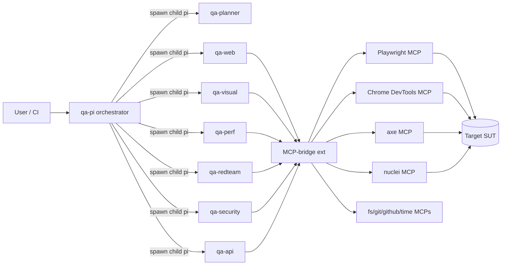

## Overview

`qa-pi` is a QA-specialized fork of [pi-mono](https://github.com/badlogic/pi-mono)'s `pi-coding-agent` by [@badlogic](https://github.com/badlogic). It keeps the original TUI, sessions, skills, and extension system — but ships preconfigured for one job: testing software.

It bundles:

- **7 specialized subagents** — planner, web e2e, API contract, visual + a11y, performance, security, red-team.
- **An MCP-bridge extension** that spawns Playwright, Chrome DevTools, axe, filesystem, git, github, time, and nuclei MCP servers and exposes their tools as native pi tools.
- **A test harness layout** under `tests/{e2e,api,visual,perf,security}/` and a `.qapi/` scope/config directory.

Each subagent runs in its own isolated `pi` child process with a least-privilege tools allowlist.

## Why qa-pi vs vanilla pi

| Concern | vanilla pi | qa-pi |
|---------|-----------|-------|
| Subagents | bring-your-own | 7 ready, role-tuned |
| Browser automation | shell only | Playwright MCP |
| A11y / perf | none | axe + Chrome DevTools MCP |
| Security tools | none | nuclei + scope gating |
| Red-team gate | n/a | hard scope-file requirement |
| Test layout | none | conventional `tests/` tree |

If you are writing application code, use `pi`. If you are testing it, use `qa-pi`.

## Quick Start

```bash
sudo npm i -g qa-pi
export ANTHROPIC_API_KEY=sk-ant-...
qa-pi --version
```

Smoke test:

```bash
cd /path/to/your/app
qa-pi -p "/qa-plan ./docs/feature-checkout.md"
```

This invokes `qa-planner` only and writes a plan to stdout. Nothing is executed against the SUT.

Run the full suite once you have a plan:

```bash
qa-pi -p "/qa-run --plan .qapi/plans/checkout.md"
```

## The 7 Subagents

| Agent | Model | When to use |
|-------|-------|-------------|
| `qa-planner` | opus-4-7 | Start here. Reads spec/PR, emits test matrix and assignments. |
| `qa-web` | sonnet-4-5 | Browser e2e. Authors Playwright tests and runs them. |
| `qa-api` | sonnet-4-5 | REST/GraphQL contract + integration tests via curl/jq. |
| `qa-visual` | sonnet-4-5 | Pixel diffs against baselines + axe a11y audits. |
| `qa-perf` | sonnet-4-5 | Lighthouse, Core Web Vitals, light load tests. |
| `qa-security` | opus-4-7 | OWASP Top 10, nuclei, headers, secrets. Scope-gated. |
| `qa-redteam` | opus-4-7 | Adversarial chains, IDOR, races, prompt injection. **Hard** scope gate. |

See `agents/*.md` for the full system prompt and tools allowlist of each.

## Bundled MCPs

| MCP | Purpose |
|-----|---------|
| `@playwright/mcp` | Headless browser drive (navigate, click, screenshot, evaluate). |
| `chrome-devtools-mcp` | Lighthouse runs, performance traces, coverage. |
| axe (wrapper) | WCAG 2.2 a11y rule engine and contrast checks. |
| `@modelcontextprotocol/server-filesystem` | Scoped read/write outside cwd. |
| `@modelcontextprotocol/server-git` | `status`, `diff`, `log` against the repo. |
| `@modelcontextprotocol/server-github` | Issues, PRs, reviews. |
| `mcp-server-time` | Stable timestamps for artifact naming. |
| nuclei (wrapper) | Template-based vulnerability scanning. |

Configuration: `~/.qapi/agent/qa-mcp.json`. See `MCP-SETUP.md`.

## Architecture



Full breakdown in `ARCHITECTURE.md`.

## Workflows

Plan only:

```bash
qa-pi -p "/qa-plan ./SPEC.md"
```

Full suite (planner → all executors in parallel where safe):

```bash
qa-pi -p "/qa-full ./SPEC.md"
```

Smoke (web + api happy paths only):

```bash
qa-pi -p "/qa-smoke"
```

Regression on a specific PR:

```bash
qa-pi -p "/qa-regress --base main --head feature/checkout"
```

Security-only run (requires `.qapi/security/scope.json`):

```bash
qa-pi -p "/qa-security"
```

Red-team (requires `.qapi/redteam/scope.json` with `confirmed: true`):

```bash
qa-pi -p "/qa-redteam"
```

## Configuration

`~/.qapi/agent/settings.json`:

```json
{
  "concurrency": 4,
  "defaultModel": "claude-opus-4-7",
  "plannerModel": "claude-opus-4-7",
  "mcpConfigPath": "~/.qapi/agent/qa-mcp.json",
  "artifactsDir": ".qapi/reports",
  "redteam": { "requireScope": true },
  "security": { "requireScope": true },
  "telemetry": false
}
```

Per-repo overrides go in `<repo>/.qapi/agent.json` and merge over the user-level file.

## Roadmap

- v0.1 — 7 subagents, MCP-bridge, plan/full/smoke/regress workflows.
- v0.2 — Test result diffing across runs, GitHub PR comments via `mcp_github_*`.
- v0.3 — Mobile (Appium MCP), API fuzzing (RESTler/Schemathesis).
- v0.4 — Self-hosted result dashboard.
- v1.0 — Stable agent contract, plugin marketplace.

## Credits

- Based on [`pi-mono`](https://github.com/badlogic/pi-mono) by [@badlogic](https://github.com/badlogic) — qa-pi reuses pi's TUI, session, and extension primitives. All upstream credit and gratitude.
- Playwright, Chrome DevTools, axe-core, nuclei: their respective authors.

## License

MIT. See `LICENSE`.

---

© 2026 [bytak.in](https://bytak.in) — built by Tak1tak
